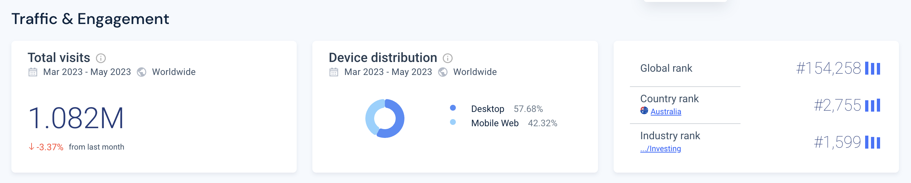
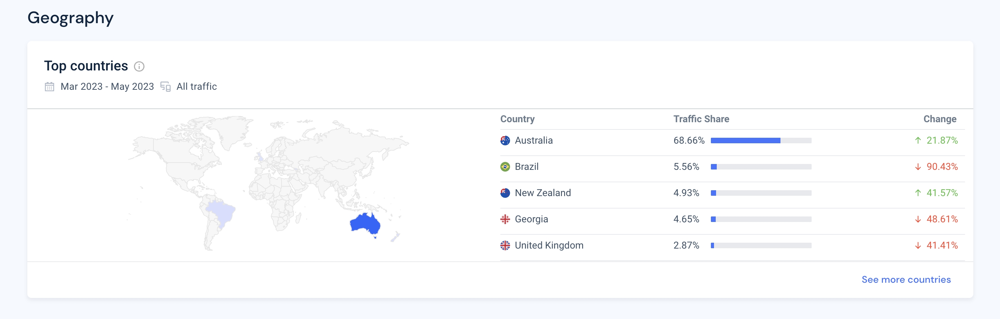
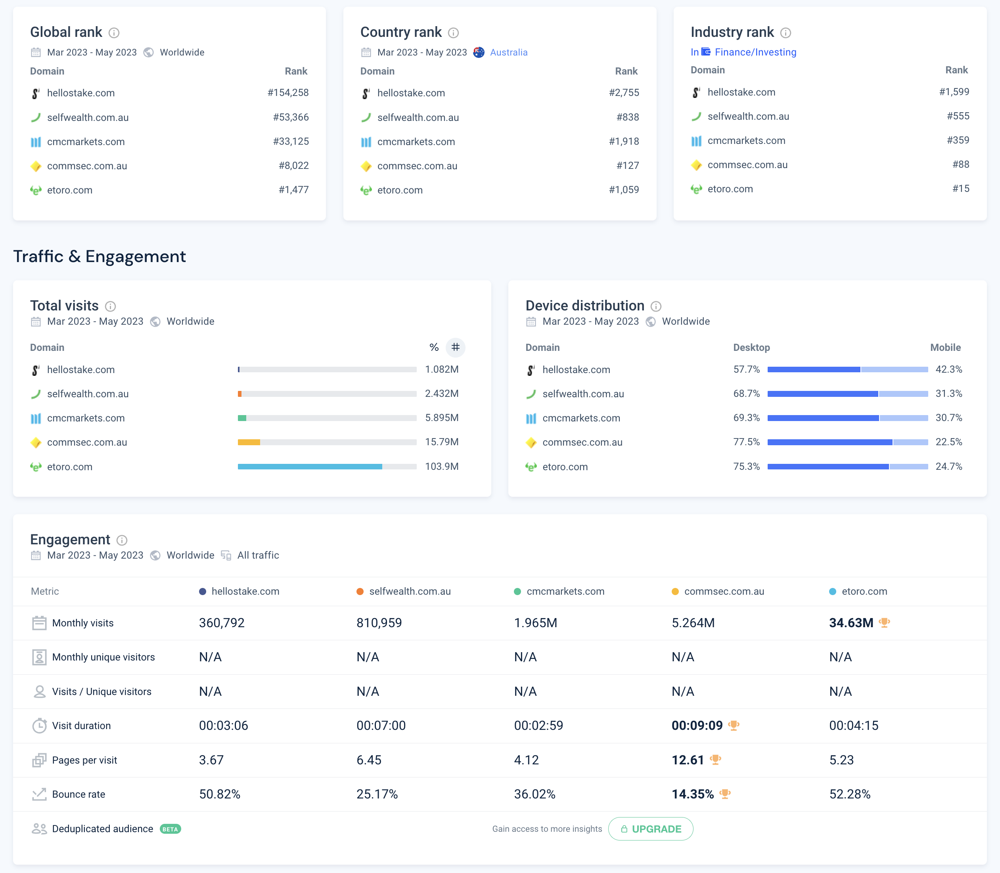

# Stake

## Table of Contents
1.  [Overview and Origin](#overview-and-origin)
	* [When was the company incorporated?](#when-was-the-company-incorporated)
	* [Who are the founders of the company?](#who-are-the-founders-of-the-company)
	* [How did the idea for the company come about?](#how-did-the-idea-for-the-company-come-about)
	* [How is the company funded?](#how-is-the-company-funded-how-much-funding-have-they-received)
	
2.  [Business Activities](#business-activities)
	* [What specific financial problem is the company trying to solve?](#what-specific-financial-problem-is-the-company-trying-to-solve)
	* [Who is the intended customer?](#who-is-the-intended-customer-is-there-any-information-about-the-market-size-of-this-set-of-customers)
	* [What solution does this company offer that its competitors do not or cannot offer?](#what-solution-does-this-company-offer-that-their-competitors-do-not-or-cannot-offer-what-is-the-unfair-advantage-they-utilise)
	* [Which technologies are they currently using, and how are they implementing them?](#which-technologies-are-they-currently-using-and-how-are-they-implementing-them)

3. [Landscape](#landscape)
	* [What domain of the financial industry is the company in?](#what-domain-of-the-financial-industry-is-the-company-in)
	* [What have been the major trends and innovations of this domain over the last 5-10 years?](#what-have-been-the-major-trends-and-innovations-of-this-domain-over-the-last-5-10-years)
	* [What are the other major companies in this domain?](#what-are-the-other-major-companies-in-this-domain)

4.  [Results](#results)
	* [What has been the business impact of this company so far?](#what-has-been-the-business-impact-of-this-company-so-far)
	* [What are some of the core metrics that companies in this domain use to measure success?](#what-are-some-of-the-core-metrics-that-companies-in-this-domain-use-to-measure-success-how-is-your-company-performing-based-on-these-metrics)
	* [How is your company performing relative to competitors in the same domain?](#how-is-your-company-performing-relative-to-competitors-in-the-same-domain)

5.  [Recommendations](#recommendations)
	* [If you were to advise the company, what products or services would you suggest they offer?](#if-you-were-to-advise-the-company-what-products-or-services-would-you-suggest-they-offer)
	* [Why do you think that offering this product or service would benefit the company?](#why-do-you-think-that-offering-this-product-or-service-would-benefit-the-company)
	* [What technologies would this additional product or service utilise?](#what-technologies-would-this-additional-product-or-service-utilise)
	* [Why are these technologies appropriate for your solution?](#why-are-these-technologies-appropriate-for-your-solution)
6.  [References](#references)

## Overview and Origin

### When was the company incorporated?

* The company Stake was officially incorporated on 08/01/2016 under the name STAKESHOP PTY LTD and is headquartered in Sydney, Australia. [(1)](https://connectonline.asic.gov.au/RegistrySearch/faces/landing/panelSearch.jspx?searchText=610105505&searchType=OrgAndBusNm&_adf.ctrl-state=5cwer73fi_48).

### Who are the founders of the company?

* The founders of Stake are Matt Leibowitz and Dan Silver. [(2)](https://en.wikipedia.org/wiki/Stake_(platform)).

### How did the idea for the company come about?

* The idea for Stake came from the two Australian founders who felt as though they wanted better access to the US markets. As it originally stood, there were only a few brokers with access to the US markets and the process was very slow and expensive. [(3)](https://techround.co.uk/interviews/daniel-slutzkin-stake/).

### How is the company funded? How much funding have they received?

* Since launch, Stake has been able to successfully raise A$93.5M in funding. The funding activities have been set out over three instances, the original Seed funding of A$3.5M conducted on the 04/08/19, Round 1 Series A funding of A$40M on the 18/05/21 and Round 2 Series A funding of A$50M. The primary investors in Stake include Leigh McPherson, Sergio Kulikovsky, Kenneth Hodgson, Tiger Global Management and DST Global. [(4)](https://www.crunchbase.com/organization/stake-2/company_financials).

---
## Business Activities:

### What specific financial problem is the company trying to solve?

* The original solution Stake was trying to create was to open Australians up to the US Markets, whilst maintaining a user-friendly interface and keeping fees low for investors. 

### Who is the intended customer? Is there any information about the market size of this set of customers?

* The initial customer base for Stake were Australian investors that wanted access to the US Markets for low-cost brokerage fees. Stake, an Australian-based and regulated trading platform, has expanded its reach to include the UK, New Zealand, and Brazil. This expansion allows residents of those countries to access a US trading platform through Stake. Although available to users in multiple countries, Stake primarily caters to Australian users [(5)](https://finty.com/au/investing/stake-review/).
  
* The market size for Australian investors is estimated to be around 7.7M [(6)](https://smallcaps.com.au/asx-investor-study-2023-record-number-adult-investors-women-younger-australians-market-growth/#:~:text=%E2%80%9COur%20latest%20study%20has%20found,38%25%20of%20Australian%20adults.%E2%80%9D). Engagement across Stakes platforms has totaled 1.082M over the last 3 Months, split between Desktop (Web) and Mobile (App) at 57.68% and 42.82%, respectively [(7)](https://pro.similarweb.com/#/digitalsuite/websiteanalysis/overview/website-performance/*/999/3m?webSource=Total&key=hellostake.com).

* Geographical representation across the platform engagement is shown below [(7)](https://pro.similarweb.com/#/digitalsuite/websiteanalysis/overview/website-performance/*/999/3m?webSource=Total&key=hellostake.com):

### What solution does this company offer that their competitors do not or cannot offer? (What is the unfair advantage they utilise?)

* The key offerings from Stake that are less utilised from other competitors are:
  * Low-fee stock and ETF Trading on Australian, NZ and US Markets.
  * Fast and fully digital account setup and management.
  * User-friendly and simple interface(s) that allows users to get into the markets very quickly.

### Which technologies are they currently using, and how are they implementing them?

* The current technologies that Stake utilise across their platform(s) are categorised below [(8)](https://www.crunchbase.com/organization/stake-2/technology/builtwith?tab=builtwith_tech_used):
    * Analytics
        * KnowBe4
    * CDN (Content Delivery Network)
        * Amazon CloudFront
    * CMS (Content Management System
        * Atlassian Cloud
    * Design
        * Adobe Fonts
        * Google Fonts
    * Digital Marketing
        * Google Tag Manager
    * Hosting
        * Amazon
        * AWS S3
        * Google
        * GoogleCloud
    * Email Hosting Providers
        * SPF (Sender Policy Framework)
        * MailChimp SPF
        * Postmark
        * Microsoft Azure DNS
        * Sendgrid
        * Google Apps of Business
        * Autopilot SPF
    * Languages and Frameworks
        * HTML5
        * Swift
    * Name Server
        * Amazon Route S3
    * Server IP Framework
        * IPv6
    * Support
        * Freshdesk

* With the listed technologies Stake offers both a web interface and mobile application, which features a user-friendly interface, enabling individuals to utilise 2FA and biometrics. The platform(s) provide comprehensive search capabilities, allowing users to access price charts and certain fundamental data. 

  In addition to the base offerings within the services, there is an additional service on offer namely Stake Black. Stake Black is the premium plan that allows users gain access to equity analyst ratings and price targets for individual stocks as well [(9)](https://stockapps.com/au/). Additional information on Stake's proprietary authentication and management software is listed on the Australian Patents Office Website, Patent ID (2022221447) [(10)](http://pericles.ipaustralia.gov.au/ols/auspat/applicationDetails.do?applicationNo=2022221447).
---

## Landscape:

### What domain of the financial industry is the company in?

* Stake is a company that operates in the Stock Trading & Investment domain of the FinTech industry.

### What have been the major trends and innovations of this domain over the last 5-10 years?

* One of the key innovations that have accelerated the ease of access and high throughput trading has been the evolution of trading through the internet. The internet has created an enormous markets for both institutional and retail investors, whereby the introduction of financial websites and online trading platforms [(11)](https://www.investopedia.com/financial-edge/0212/how-the-internet-has-changed-investing.aspx).
* Adoption and utilisation of online trading platforms have completed changed the way investors interact with trading and investing into the markets. Some of the key benefits of the transformation into online trading platforms are [(12)](https://www.geeksforgeeks.org/how-technology-has-influenced-the-stock-market/):
	* It has made the experience hassle-free
	* It is more convenient and accessible
	* Provides you with a better understanding of your money
	* Removes the role of middleman
	* It provides you with the perk of trading at your fingertips
	* Enhances your understanding of the stocks
	* Fees, on average, has significantly reduced for retail investors
	* Faster transaction times
	* Real-time market analysis and monitoring 
	* Enhanced Security Features
	* The introduction and implementation of Blockchain technology
* The adoption of online trading platforms has created significant positive change for beginner to advanced investors and as the technologies that these platforms have been built on improve, the experience and security behind these systems will improve in conjunction. 

### What are the other major companies in this domain?

* There are a number of stock trading platforms in Australia, including Australian banks, that are listed below [(13)](https://arielle.com.au/best-stock-trading-app-australia/):
  * Banking Institutions
    * CommSec
    * NABtrade
    * ANZ
    * Westpac
    * Bendigo Invest Direct
    * St George
    * Macquarie
    * HSBC
  * Stock Trading Platforms
    * eToro
    * Pepperstone
    * Plus500
    * Raiz
    * Tiger Brokers
    * CMC Markets
    * Think Markets
    * SelfWealth
    * Interactive Brokers
    * Superhero
    * Pearler
    * OANDA 
    * Avatrade
    * IG Markets
    * IG
  

## Results

### What has been the business impact of this company so far?
* Stake has grown into a successful financial services company with over 130 employees across Australia, New Zealand, Brazil and the UK. With more than A$2 billion in assets under administration. [(14)](https://www.linkedin.com/company/hello-stake/about/).
* Stake has product offerings in the US Equities, AU Equities (CHESS-Sponsored) and Investments. The company has also recently expanded into Self-Managed Superannuation Funds (SMSF) known as Stake Super. 
* Stake is expanding its technological capabilities as well as its global presence through partnerships with Finclear, Drivewealth, Airwallex, POLi, Sanlam, Trulioo and TrueLayer. [(15)](https://hellostake.com/au)

### What are some of the core metrics that companies in this domain use to measure success? How is your company performing, based on these metrics?

* As an online trading platform, there are core metrics that can be measured: number of investors of the platform, total value of assets under administration, website traffic and engagement and revenues. Based on the data obtained Stake is performing moderately well in a highly competitive market. Current company statistics are listed below:
	* Number of Investors : 500,000 [(14)](https://www.linkedin.com/company/hello-stake/about/).
	* Value of Assets: $2B [(14)](https://www.linkedin.com/company/hello-stake/about/).
	* Website Traffic: 300K/Month[(7)](https://pro.similarweb.com/#/digitalsuite/websiteanalysis/overview/website-performance/*/999/3m?webSource=Total&key=hellostake.com).
	* Revenue: $33.5M [(16)](https://www.zoominfo.com/c/stake/476686933)
 
### How is your company performing relative to competitors in the same domain?
* A primary metric that is measurable and attainable, considering the nature of this business, is website traffic and engagement. Below is a summary of Stake and four competitors in the same domain within the Australian investment market:

* Stake is currently one of the lower performing platform when observing the data. There are many reasonable reasons as to why the company has its current performance in the online trading market, one perhaps it being a newer company in the market. 

## Recommendations

### If you were to advise the company, what products or services would you suggest they offer?

* Stake is a very well designed trading platform that offers Stocks and ETFs in Australian and US Markets. I would advise the company branch into further markets whilst maintaining its current low cost model to investors. Stake would benefit from expanding their portfolio of offerings into Cryptocurrencies, Commodities , CFDs and broader global exchanges.  

### Why do you think that offering this product or service would benefit the company?

* With an expanded portfolio of offerings in parallel with a low cost pricing model and user friendly interface, Stake has an enormous opportunity to becomes one of the biggest online trading platforms. If investors were able to trade CFDs, for example, there would be tremendous growth within Stake.
 
### What technologies would this additional product or service utilise?

* In order for Stake to add the suite of products listed above into their portfolio of offerings a substantial number of technologies will need to be incorporated. Including Blockchain, Openlink and Integration into the respective global exchanges.
 
### Why are these technologies appropriate for your solution?

* The most appropriate technology that will be utilised now and into the future, with respect to fintech and future markets is blockchain technology. Utilising blockchain, whereby each transaction is recorded on a block that is linked to the previous block, forming a chain of blocks. This creates a extremely robust structure that makes it difficult for transactions to be altered or tampered with, as any changes would need to be made to all subsequent blocks in the chain. [(17)](https://itmunch.com/blockchain-technology-will-pave-the-way-for-transparent-and-bank-less-financial-services/).
* With this type of structure implemented in new and existing products from Stake, they are sure to be a power within the FinTech space. 

---
## References

1. [ASIC](https://connectonline.asic.gov.au/RegistrySearch/faces/landing/panelSearch.jspx?searchText=610105505&searchType=OrgAndBusNm&_adf.ctrl-state=5cwer73fi_48)
2. [Wikipedia](https://en.wikipedia.org/wiki/Stake_(platform))
3. [TechRound](https://techround.co.uk/interviews/daniel-slutzkin-stake/)
4. [Crunchbase](https://www.crunchbase.com/organization/stake-2/company_financials)
5. [Finty](https://finty.com/au/investing/stake-review/)
6. [SmallCaps](https://smallcaps.com.au/asx-investor-study-2023-record-number-adult-investors-women-younger-australians-market-growth/#:~:text=%E2%80%9COur%20latest%20study%20has%20found,38%25%20of%20Australian%20adults.%E2%80%9D)
7. [Similarweb](https://pro.similarweb.com/#/digitalsuite/websiteanalysis/overview/website-performance/*/999/3m?webSource=Total&key=hellostake.com)
8. [Crunchbase](https://www.crunchbase.com/organization/stake-2/technology/builtwith?tab=builtwith_tech_used)
9. [StockApps](https://stockapps.com/au/)
10. [Australian Patent Office](http://pericles.ipaustralia.gov.au/ols/auspat/applicationDetails.do?applicationNo=2022221447)
11. [Investopedia](https://www.investopedia.com/financial-edge/0212/how-the-internet-has-changed-investing.aspx)
12. [Geeks for Geeks](https://www.geeksforgeeks.org/how-technology-has-influenced-the-stock-market/)
13. [Arielle Executive](https://arielle.com.au/best-stock-trading-app-australia/)
14. [Linkedin](https://www.linkedin.com/company/hello-stake/about/)
15. [Stake](https://hellostake.com/au)
16. [ZoomInfo](https://www.zoominfo.com/c/stake/476686933)
17. [ITMunch](https://itmunch.com/blockchain-technology-will-pave-the-way-for-transparent-and-bank-less-financial-services/)
---
