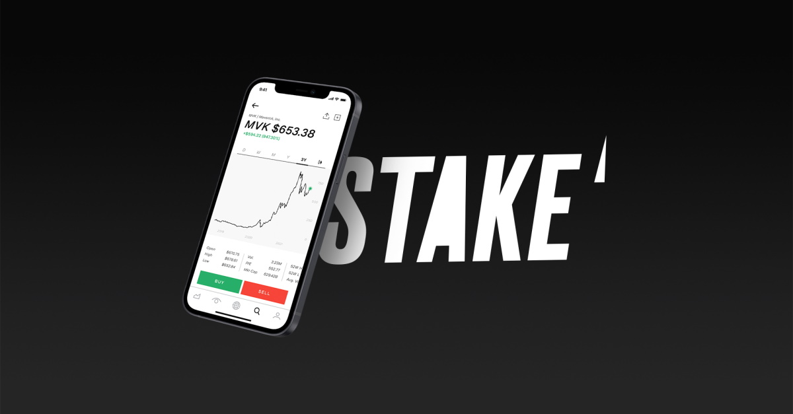
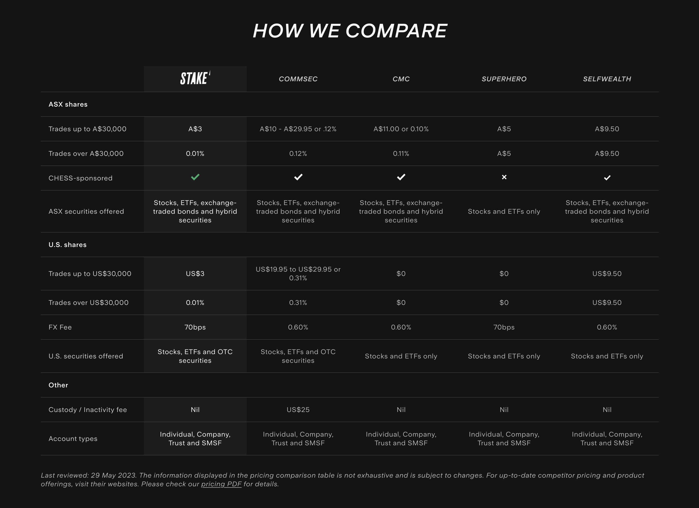

# Stake
### Overview and Origin

##### When was the company incorporated?
* The company Stake was officially incorporated on 08/01/2016 under the name STAKESHOP PTY LTD and is headquartered in Sydney, Australia. [(1)](https://connectonline.asic.gov.au/RegistrySearch/faces/landing/panelSearch.jspx?searchText=610105505&searchType=OrgAndBusNm&_adf.ctrl-state=5cwer73fi_48)

##### Who are the founders of the company?
* The founders of Stake are Matt Leibowitz and Dan Silver. [(2)](https://en.wikipedia.org/wiki/Stake_(platform))

##### How did the idea for the company (or project) come about?
* The idea for Stake came from the two Australian founders who felt as though they wanted better access to the US markets. As it originally stood, there were only a few brokers with access to the US markets and the proces was very slow and expensive. [(3)](https://techround.co.uk/interviews/daniel-slutzkin-stake/)

##### How is the company funded? How much funding have they received?
* Since launch, Stake has been able to successfully raise A$93.5M in funding. The funding activites have been set out over three instances, the original Seed funding of A$3.5M conducted on the 04/08/19, Round 1 Series A funding of A$40M on the 18/05/21 and Round 2 Series A funding of A$50M. The primary investors in Stake include Leigh McPherson, Sergio Kulikovsky, Kenneth Hodgson, Tiger Global Management and DST Global. [(4)](https://www.crunchbase.com/organization/stake-2/company_financials)

## Business Activities:

##### What specific financial problem is the company or project trying to solve?
* The original solution Stake was trying to create was to open Australians up to the US Markets, whilst maintaining a user-frendly interface and keeping fees low to traders. 

##### Who is the company's intended customer?  Is there any information about the market size of this set of customers?
* The initial customer base for Stake were Australian traders that wanted access to the US Markets for low-cost brokerage fees. Stake, an Australian-based and regulated trading platform, has expanded its reach to include the UK, New Zealand, and Brazil. This expansion allows residents of those countries to access a US trading platform through Stake. Although available to users in multiple countries, Stake primarily caters to Australian users [(9)](https://finty.com/au/investing/stake-review/).
  
* The market size for Australian investors is estimated to be around 7.7M[(10)](https://smallcaps.com.au/asx-investor-study-2023-record-number-adult-investors-women-younger-australians-market-growth/#:~:text=%E2%80%9COur%20latest%20study%20has%20found,38%25%20of%20Australian%20adults.%E2%80%9D). Engagement across Stakes platforms has totaled 1.082M over the last 3 Months, split between Desktop and Mobile at 57.68% and 42.82% respectively [(11)](https://pro.similarweb.com/#/digitalsuite/websiteanalysis/overview/website-performance/*/999/3m?webSource=Total&key=hellostake.com).

* Geographical representation across the platfrom engagement is shown below [(11)](https://pro.similarweb.com/#/digitalsuite/websiteanalysis/overview/website-performance/*/999/3m?webSource=Total&key=hellostake.com):

##### What solution does this company offer that their competitors do not or cannot offer? (What is the unfair advantage they utilize?)
* The key offerings from Stake that are less utilised from other competitors are:
  * Low-fee stock and ETF Trading on Australian, NZ and US Markets
  * Fast and fully digital account setup and management
  * User-friendly and simple interface(s)

##### Which technologies are they currently using, and how are they implementing them?
* The current technologies that Stake utilise across their platform(s) are categorised below [(5)](https://www.crunchbase.com/organization/stake-2/technology/builtwith?tab=builtwith_tech_used):
    * Analytics
        * KnowBe4
    * CDN (Content Delivery Network)
        * Amazon CloudFront
    * CMS (Content Management System
        * Atlassian Cloud
    * Design
        * Adobe Fonts
        * Google Fonts
    * Digital Marketing
        * Google Tag Manager
    * Hosting
        * Amazon
        * AWS S3
        * Google
        * GoogleCloud
    * Email Hosting Providers
        * SPF (Sender Policy Framework)
        * MailChimp SPF
        * Postmark
        * Microsoft Azure DNS
        * Sendgrid
        * Google Apps of Business
        * Autopilot SPF
    * Languages and Frameworks
        * HTML5
        * Swift
    * Name Server
        * Amazon Route S3
    * Server IP Framework
        * IPv6
    * Support
        * Freshdesk

* With the listed technologies Stake offers both a web interface and mobile application, which features a user-friendly interface, enabling individuals to utilise 2FA and bio-metrics. The app provides comprehensive search capabilities, allowing users to access price charts and certain fundamental data.

  In addition to the base offerings within the services, there is an additional service on offer namely Stake Black. Stake Black is the premium plan that allows users gain access to equity analyst ratings and price targets for individual stocks as well [(7)](https://stockapps.com/au/).

## Landscape:

##### What domain of the financial industry is the company in?
* Stake is a company that operates in the Stock Trading & Investment domain of the FinTech industry.

##### What have been the major trends and innovations of this domain over the last 5-10 years?
*

##### What are the other major companies in this domain?
* There are a number of stock trading platforms in Australia, including Australian banks, that are listed below [(8)](https://arielle.com.au/best-stock-trading-app-australia/):
  * Banking Instiutions
    * CommSec
    * NABtrade
    * ANZ
    * Westpac
    * Bendigo Invest Direct
    * St George
    * Macquarie
    * HSBC
  * Stock Trading Platforms
    * eToro
    * Pepperstone
    * Plus500
    * Raiz
    * Tiger Brokers
    * CMC Markets
    * Think Markets
    * SelfWealth
    * Interactive Brokers
    * Superhero
    * Pearler
    * OANDA 
    * Avatrade
    * IG Markets
    * IG
  

## Results

##### What has been the business impact of this company so far?
* 

##### What are some of the core metrics that companies in this domain use to measure success? How is your company performing, based on these metrics?
*
 
##### How is your company performing relative to competitors in the same domain?
* 

## Recommendations

##### If you were to advise the company, what products or services would you suggest they offer? (This could be something that a competitor offers, or use your imagination!)
* 

##### Why do you think that offering this product or service would benefit the company?
*
 
##### What technologies would this additional product or service utilize?
*
 
##### Why are these technologies appropriate for your solution?
* 

## References
1. [ASIC](https://connectonline.asic.gov.au/RegistrySearch/faces/landing/panelSearch.jspx?searchText=610105505&searchType=OrgAndBusNm&_adf.ctrl-state=5cwer73fi_48)
2. [Wikipedia](https://en.wikipedia.org/wiki/Stake_(platform))
3. [TechRound](https://techround.co.uk/interviews/daniel-slutzkin-stake/)
4. [Crunchbase](https://www.crunchbase.com/organization/stake-2/company_financials)
5. [Crunchbase](https://www.crunchbase.com/organization/stake-2/technology/builtwith?tab=builtwith_tech_used)
6. [Australian Patent Office](http://pericles.ipaustralia.gov.au/ols/auspat/applicationDetails.do?applicationNo=2022221447)
7. [StockApps](https://stockapps.com/au/)
8. [Arielle Executive](https://arielle.com.au/best-stock-trading-app-australia/)
9. [Finty](https://finty.com/au/investing/stake-review/)
10. [SmallCaps](https://smallcaps.com.au/asx-investor-study-2023-record-number-adult-investors-women-younger-australians-market-growth/#:~:text=%E2%80%9COur%20latest%20study%20has%20found,38%25%20of%20Australian%20adults.%E2%80%9D)
11. [Similarweb](https://pro.similarweb.com/#/digitalsuite/websiteanalysis/overview/website-performance/*/999/3m?webSource=Total&key=hellostake.com)
