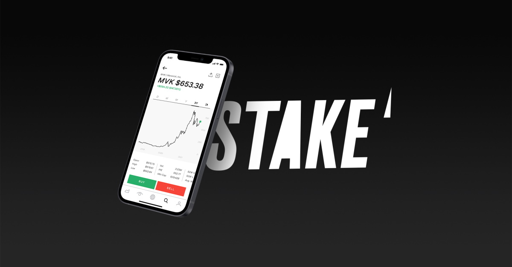

# Stake
### Overview and Origin
###### When was the company incorporated?
* The company Stake was officially incorporated on 08/01/2016 under the name STAKESHOP PTY LTD and is headquartered in Sydney, Australia. [1](https://connectonline.asic.gov.au/RegistrySearch/faces/landing/panelSearch.jspx?searchText=610105505&searchType=OrgAndBusNm&_adf.ctrl-state=5cwer73fi_48)

###### Who are the founders of the company?
* The founders of Stake are Matt Leibowitz and Dan Silver. [2](https://en.wikipedia.org/wiki/Stake_(platform))
###### How did the idea for the company (or project) come about?

* The idea for Stake came from the two Australian founders who felt as though they wanted better access to the US markets. As it originally stood, there were only a few brokers with access to the US markets and the proces was very slow and expensive. [3](https://techround.co.uk/interviews/daniel-slutzkin-stake/)

###### How is the company funded? How much funding have they received?
* Since launch, Stake has been able to successfully raise A$93.5M in funding. The funding activites have been set out over three instances, the original Seed funding of A$3.5M conducted on the 04/08/19, Round 1 Series A funding of A$40M on the 18/05/21 and Round 2 Series A funding of A$50M. The primary investors in Stake include Leigh McPherson, Sergio Kulikovsky, Kenneth Hodgson, Tiger Global Management and DST Global. [4](https://www.crunchbase.com/organization/stake-2/company_financials)

## Business Activities:

###### What specific financial problem is the company or project trying to solve?
* 
###### Who is the company's intended customer?  Is there any information about the market size of this set of customers?
* 
###### What solution does this company offer that their competitors do not or cannot offer? (What is the unfair advantage they utilize?)
* 
###### Which technologies are they currently using, and how are they implementing them? (This may take a little bit of sleuthing–– you may want to search the company’s engineering blog or use sites like Stackshare to find this information.)
* 
## Landscape:

###### What domain of the financial industry is the company in?
* 
###### What have been the major trends and innovations of this domain over the last 5-10 years?
* 
###### What are the other major companies in this domain?
* 
## Results

###### What has been the business impact of this company so far?
* 
###### What are some of the core metrics that companies in this domain use to measure success? How is your company performing, based on these metrics?
* 
###### How is your company performing relative to competitors in the same domain?
* 
## Recommendations

###### If you were to advise the company, what products or services would you suggest they offer? (This could be something that a competitor offers, or use your imagination!)
* 
###### Why do you think that offering this product or service would benefit the company?
* 
###### What technologies would this additional product or service utilize?
* 
###### Why are these technologies appropriate for your solution?
* 

## References
1. [ASIC](https://connectonline.asic.gov.au/RegistrySearch/faces/landing/panelSearch.jspx?searchText=610105505&searchType=OrgAndBusNm&_adf.ctrl-state=5cwer73fi_48)
2. [Wikipedia](https://en.wikipedia.org/wiki/Stake_(platform))
3. [TechRound](https://techround.co.uk/interviews/daniel-slutzkin-stake/)
4. [Crunchbase](https://www.crunchbase.com/organization/stake-2/company_financials)
